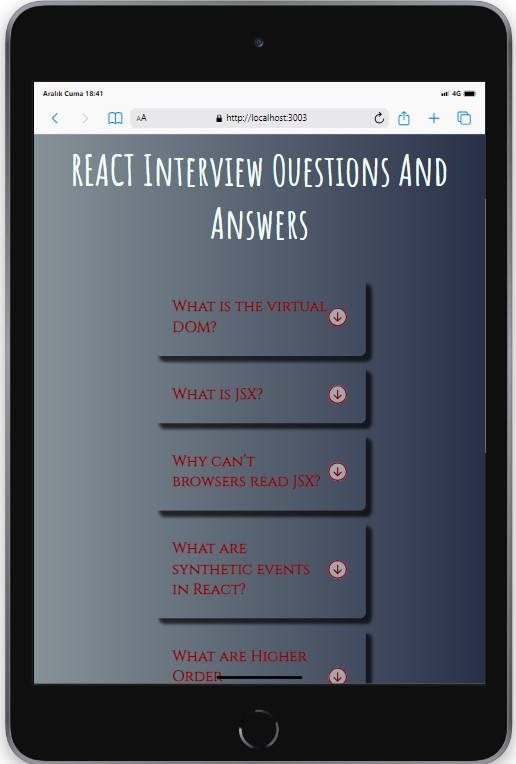

<br />
<div align="center" id="readme-top">
  <a href="#">
    
  </a>

  <h3 align="center">Interview Accord</h3>
  <p align="center">
    <a href="https://interview-accord-react.netlify.app/"><strong> 👩‍⚕️ LIVE 👨‍⚕️ »</strong></a>
    <br />
  </p>
</div>


## Description

Project aims to create a Interview Accord App.
You can find some questions and answers that may arise during interviews about React in the application I created with React.

## Project Skeleton

```
Interview-Accordion (folder)
|
|----readme.md         # Given to the students (Definition of the project)
SOLUTION
├── public
│     └── index.html
├── src
│   ├── App.css
│   ├── App.js
│   ├── components
│   │   ├── Question.jsx
│   │   ├── Header.jsx
│   │   └── InterviewAccord.jsx
│   ├── helper
│   │   ├── data.js
│   │   └── icons.js
│   └── index.js
├── package.json
└── package-lock.json

```

## Expected Outcome


## Objective

Build a Interview Accord App using ReactJS.

### At the end of the project, following topics are to be covered;

- HTML

- CSS

- JS

- ReactJS

### At the end of the project, students will be able to;

- improve coding skills within HTML & CSS & JS & ReactJS.

- use git commands (push, pull, commit, add etc.) and Github as Version Control System.

## Steps to Solution

- Step 1: Create React App using `npx create-react-app interview-accordion`

- Step 2: Build Interview Accord App.

- Step 3: Push your application into your own public repo on Github

- Step 4: Add project gif to your project and README.md file.


## Demo


<a href="https://interview-accord-react.netlify.app/" target="_blank">React Interview Accord Netlify</a>

**<p align="center">&#9786; Happy Coding &#9997;</p>**

## Screenshots

<div align="center">
  
  
  
</div>